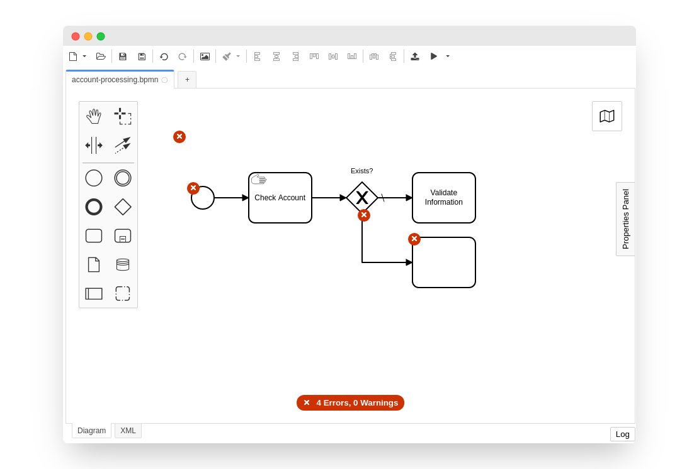

> **This plugin was replaced by the built-in linting feature of [Camunda Modeler v5.3](https://github.com/camunda/camunda-modeler/blob/develop/CHANGELOG.md#530)**. Check out the [custom lint rules plugin](https://github.com/camunda/camunda-modeler-custom-linter-rules-plugin) to learn how to add custom lint rules to the built-in linting feature.


# camunda-modeler-linter-plugin

[](https://github.com/camunda/camunda-modeler-linter-plugin/actions?query=workflow%3ACI)
[](https://github.com/camunda/camunda-modeler)

[bpmnlint](https://github.com/bpmn-io/bpmnlint/) as a plugin for the [Camunda Modeler](https://github.com/camunda/camunda-modeler/).




## Overriding Provided Rules

This plug-ins uses the [recommended bpmnlint and Camunda rules](./.bpmnlintrc).

You may override this via your own Camunda Modeler client plug-in as shown below:

```javascript
import {
  registerBpmnJSPlugin
} from 'camunda-modeler-plugin-helpers';

import customLinterConfig from './.bpmnlintrc';

registerBpmnJSPlugin({
  __init__: [
    function(linting) {
      linting.setLinterConfig(customLinterConfig);
    }
  ]
});
```

Please note that you must use the [bpmnlint-loader](https://github.com/nikku/bpmnlint-loader) to bundle your [`.bpmnlintrc`](https://github.com/bpmn-io/bpmnlint#configuration) for usage in the browser.

For a complete example, checkout the [custom-linter-rules-plugin](https://github.com/camunda/camunda-modeler-custom-linter-rules-plugin) that accomplishes this.


## Licence

MIT
